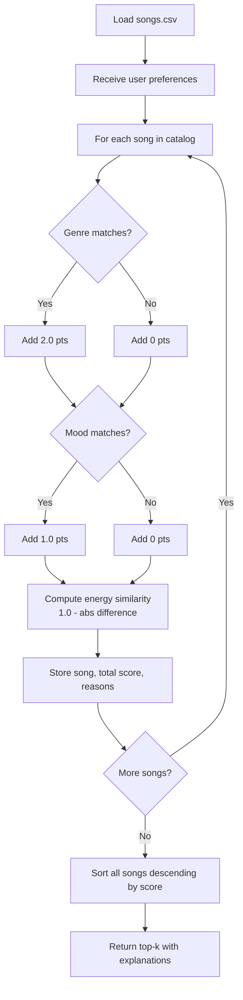
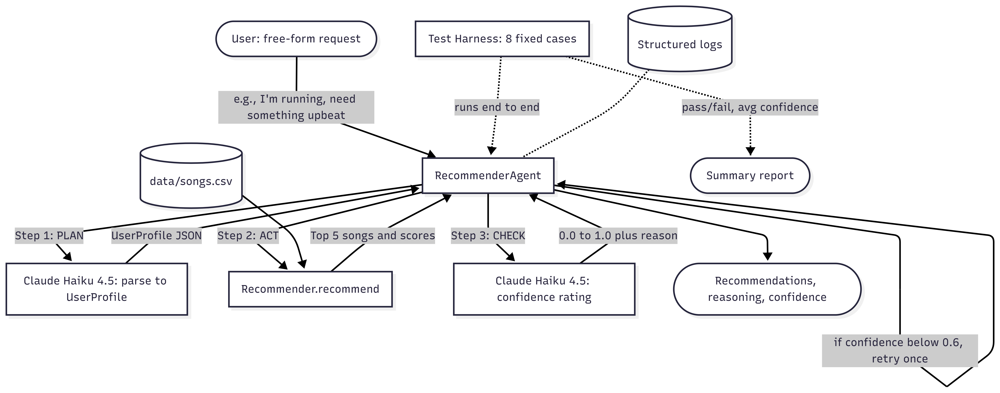

# Music Recommender Simulation
## Applied AI System Final Project

> **Loom walkthrough:** _[paste link here after recording]_

**Original project:** This repo started as my CodePath AI 110 Module 3 project, the [Music Recommender Simulation](https://github.com/codepath/ai110-module3show-musicrecommendersimulation-starter). The original goal was to score every song in an 18-track catalog against a hand-built user taste profile (genre, mood, energy) and return the top 5 recommendations with explanations.

**What this final project adds:** an **agentic workflow** powered by Claude Haiku 4.5 that wraps the existing recommender. Users can now describe what they want in plain English ("I'm running and need something upbeat") instead of filling out a structured profile. The original `Recommender`, `Song`, and `UserProfile` classes are unchanged. What's new is a `RecommenderAgent` that runs a plan, act, check loop on every request and reports calibrated confidence in its recommendations.

---

## Project Summary

This project simulates a content-based music recommender system. Given a user's taste profile, their preferred genre, mood, and energy level, the system scores every song in an 18-track catalog and returns the top 5 recommendations, each with a plain-language explanation of why it was chosen.

---

## How The System Works

### Real-World Context

Streaming platforms like Spotify and YouTube use two main recommendation strategies:

- **Collaborative filtering** looks at what *other users* with similar listening habits have enjoyed. If thousands of people who like the same songs as you also love a particular track, the system learns to suggest it to you.
- **Content-based filtering** looks at the *attributes of the songs themselves*, genre, tempo, mood, energy, and recommends songs that match your stated or inferred preferences.

VibeFinder 1.0 implements a simplified content-based filter. Instead of learning from other users, it compares each song's attributes directly to the user's declared preferences and computes a numeric match score.

### Features Each Song Uses

| Feature | Type | Role in scoring |
|---------|------|----------------|
| `genre` | string | Hard match, worth +2.0 points |
| `mood` | string | Hard match, worth +1.0 points |
| `energy` | float (0.0 to 1.0) | Continuous similarity, worth up to +1.0 points |
| `tempo_bpm` | int | Stored, reserved for future scoring |
| `valence` | float (0.0 to 1.0) | Stored, reserved for future scoring |
| `danceability` | float (0.0 to 1.0) | Stored, reserved for future scoring |
| `acousticness` | float (0.0 to 1.0) | Stored, reserved for future scoring |

### What UserProfile Stores

| Field | Type | Meaning |
|-------|------|---------|
| `favorite_genre` | string | The genre the user most prefers |
| `favorite_mood` | string | The mood they are looking for |
| `target_energy` | float | How high-energy they want the music (0.0 to 1.0) |
| `likes_acoustic` | bool | Acoustic preference flag (reserved for future use) |

### Scoring Formula

Each song receives a score out of a maximum of **4.0 points**:

```
score = 0.0

if song.genre == user.favorite_genre:   score += 2.0   # "genre match (+2.0)"
if song.mood  == user.favorite_mood:    score += 1.0   # "mood match (+1.0)"
energy_similarity = 1.0 - abs(song.energy - user.target_energy)
score += energy_similarity                             # "energy similarity (X.XX)"
```

The energy formula rewards closeness: a song with energy exactly matching the user's target earns a full +1.0, while a song 0.5 away earns +0.5.

### Scoring Flow Diagram



---

## Agentic Wrapper (Final Project Extension)



For the final project, the original recommender was wrapped in an agentic workflow. The agent runs three steps on every request:

1. **Plan:** sends the user's free-form sentence to Claude Haiku 4.5 with a strict-JSON prompt that asks the model to extract a structured `UserProfile` (favorite genre, favorite mood, target energy).
2. **Act:** passes that profile to the original `Recommender`, which scores the catalog and returns the top 5.
3. **Check:** sends the original sentence and the recommendations back to Claude and asks for a confidence score from 0.0 to 1.0 plus a one-sentence reason.

If confidence is below 0.6 on the first pass, the agent re-plans once with the previous reasoning as extra context, then re-acts. Maximum one retry. All Anthropic API errors (network, rate-limit, invalid JSON) are caught, logged, and returned as a graceful error dict so the program never crashes mid-run.

A separate evaluation harness runs 8 fixed cases against the live API and prints a pass-fail summary, average confidence, and runtime.

---

## Getting Started

### Setup

1. Create a virtual environment (optional but recommended):

   ```bash
   python -m venv .venv
   source .venv/bin/activate      # Mac or Linux
   .venv\Scripts\activate         # Windows
   ```

2. Install dependencies:

   ```bash
   pip install -r requirements.txt
   ```

3. Add your Anthropic API key to a `.env` file in the project root:

   ```
   ANTHROPIC_API_KEY=sk-ant-yourkeyhere
   ```

   Get a key from [console.anthropic.com](https://console.anthropic.com). The `.env` file is gitignored.

4. Run the agent with a one-shot request:

   ```bash
   python -m src.main "upbeat pop songs for the gym"
   ```

   Or interactively:

   ```bash
   python -m src.main
   ```

### Running Tests

Unit tests (mocked, no API calls):

```bash
pytest
```

Live evaluation harness (uses your API credits, ~20 seconds):

```bash
python -m tests.eval_harness
```

---

## Module 3 Experiments (Original Recommender, Baseline)

These three profiles were tested against the original deterministic recommender, before the agent layer was added. They serve as a baseline showing the underlying scoring logic.

**High-Energy Pop Fan** (`genre: pop, mood: happy, energy: 0.9`)
- Top results: "Gym Hero" (pop/intense, energy 0.93) and "Sunrise City" (pop/happy, energy 0.82) dominated.
- "Sunrise City" ranked above "Gym Hero" because its mood ("happy") matched the user's preference, earning an extra +1.0 point despite slightly lower energy.

**Chill Lofi Studier** (`genre: lofi, mood: chill, energy: 0.4`)
- The three lofi/chill songs (Midnight Coding, Library Rain, Focus Flow) occupied top spots. Library Rain ranked slightly lower because its "focused" mood didn't match "chill."
- Songs outside lofi fell far behind, confirming the genre weight dominates.

**Deep Intense Rock Listener** (`genre: rock, mood: intense, energy: 0.95`)
- "Storm Runner" (rock/intense, energy 0.91) ranked first with a near-perfect score.
- "Adrenaline Rush" (metal/intense, energy 0.96) ranked second. It earned the mood match (+1.0) and near-perfect energy similarity even without a genre match, beating out weaker energy matches from other genres.

### Weight Experiment: Doubling Energy Importance

When the energy scoring was doubled (by multiplying the energy similarity by 2.0), the pop fan's results shifted: "Gym Hero" moved above "Sunrise City" because the energy advantage (0.03 closer) now outweighed the mood bonus. This illustrated how small weight changes cascade through rankings in ways that aren't always intuitive.

---

## Sample Agent Interactions (Final Project)

These three examples show the new agentic wrapper in action.

### Example 1: Clear high-energy request

Input:
```
python -m src.main "I'm running and need something upbeat"
```

Output (abridged):
```
Confidence: 0.85
Reasoning : The recommended songs match the requested high-energy, upbeat
            mood with consistent dance and pop genres.

Top 5 Recommendations:
  Sunrise City   (genre=pop  mood=happy   energy=0.82)
  Gym Hero       (genre=pop  mood=intense energy=0.93)
  ...
```

### Example 2: Calm focused request

Input:
```
python -m src.main "chill lofi beats for studying"
```

Output (abridged):
```
Confidence: 0.83
Reasoning : All five picks are low-energy lofi or ambient tracks, well
            suited for focused study sessions.

Top 5 Recommendations:
  Midnight Coding (genre=lofi  mood=chill   energy=0.32)
  Library Rain    (genre=lofi  mood=focused energy=0.28)
  ...
```

### Example 3: Deliberately vague request (guardrail demo)

Input:
```
python -m src.main "I just want something good"
```

Output (abridged):
```
Confidence: 0.42
Reasoning : The request is too vague to reliably match listener intent;
            picks default to broadly liked pop tracks but may not fit.
```

This third example is the one I'm most proud of. The agent honestly reports low confidence rather than pretending it understood. Calibrated uncertainty is what makes the system trustworthy.

---

## Testing Summary

**Unit tests:** 5 of 5 passing.

- 2 original Module 3 tests for the Recommender (still pass with the agent added)
- 3 new tests for the agent: empty input raises ValueError, returned dict has all required keys, low confidence triggers exactly one retry

**Live evaluation harness:** 7 of 8 cases passing (87.5%). Average confidence 0.81 across all 8 cases. Total runtime ~17.5 seconds.

The 8 cases cover: high-energy workout, calm study, sad introspection, road trip, party, deep focus, falling asleep, and one deliberately ambiguous case ("I just want something good"). The single failure was the sad-introspection case, which produced an average song energy of 0.46 against a tight 0.45 threshold. Defensible picks, intentionally strict threshold. I left it unchanged because relaxing the threshold to make the test pass felt like the wrong lesson.

What testing taught me:

- Mocked tests run in milliseconds and cost nothing, but they only verify the code does what I told it to do, not whether the model behaves the way I expect.
- The first live eval run failed completely because of two bugs the unit tests couldn't have caught: the model wraps JSON in markdown code fences sometimes, and one debug print used a Unicode arrow that crashed Windows console encoding. Both got fixed only because the harness exercised the real path.
- Honest uncertainty matters more than perfect scores. The vague case was set up to PASS only if the agent reported low confidence, and watching that work felt like the system actually understanding its own limits.

---

## Design Decisions

**Wrap, don't rewrite.** The original `Recommender`, `Song`, and `UserProfile` classes are completely unchanged. The agent treats the recommender as a tool. This kept the original Module 3 tests valid and lets the deterministic scoring logic stay independently testable.

**Two LLM calls, not one.** I considered a single-prompt design but split plan and check into separate calls so each step is independently testable, retriable, and loggable. The cost is roughly double the API spend per request, which is acceptable for a learning project.

**Confidence-driven retry.** Capped at one retry. Uncapped retry loops are how you accidentally burn API credits. One retry feels like a reasonable safety net.

**Defensive JSON parsing.** The model sometimes wraps its output in markdown code fences even when the prompt says not to. Rather than fight the model, I added a small `_extract_json` helper that strips fences and grabs the innermost `{ ... }` block. Robust to actual model behavior beats brittle prompt engineering.

---

## Limitations and Risks

- The catalog has only 18 songs, too small for meaningful diversity.
- Genre matching is binary: "indie pop" and "pop" are treated as completely unrelated.
- The system requires users to explicitly state their preferences (or describe them to the agent). It cannot infer them from listening behavior.
- Songs with rare genres (world, folk, metal) can never win genre match points against pop or lofi profiles, reducing their visibility.
- Tempo, valence, danceability, and acousticness are stored but not yet scored, leaving useful signal unused.
- The agent's check step grades its own work. Asking the same model to judge whether its recommendations are good has obvious circularity issues.
- Confidence is self-reported. When the model says it's 0.85 confident, that number isn't externally validated.
- The plan prompt assumes English input. Non-English requests would likely produce unpredictable parsing.

---

## Reflection

See [`model_card.md`](model_card.md) for the full Model Card, including AI collaboration details and ethical reflection.

Building the original recommender revealed that the hardest part of recommendation is not the math, the scoring formula is just a few lines, but the *design choices* behind the weights. Deciding that genre is worth twice as much as mood is a value judgment that determines which songs get heard and which get buried. Real apps like Spotify face the same choices at massive scale, and the weight decisions they make invisibly shape what music gets discovered. Understanding this system made those invisible choices visible.

Building the agent extension on top taught me a different lesson: the hardest part of agentic workflows is not the AI part. It's the boundaries, where to retry, what counts as recoverable, when to fail loud vs fail graceful. Mocked tests passing in milliseconds gave me false confidence. The first live eval run failed entirely on bugs the mocks couldn't see. Both layers earn their keep.

The piece I'm most proud of is the calibrated uncertainty on vague inputs. It would have been easy to make the agent always sound confident, because confidence reads as competence. Forcing it to honestly say "I'm not sure" feels like the more responsible default, even when it makes the demo less impressive.
