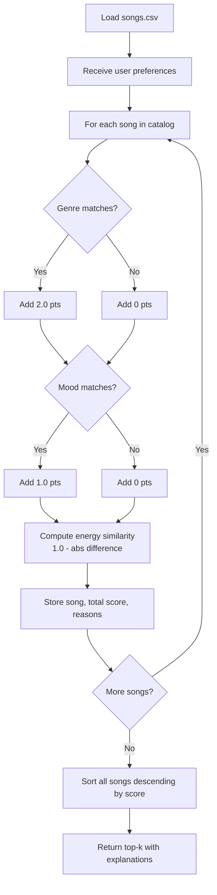
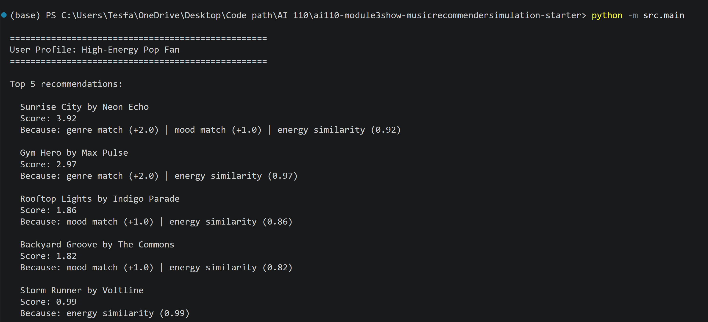
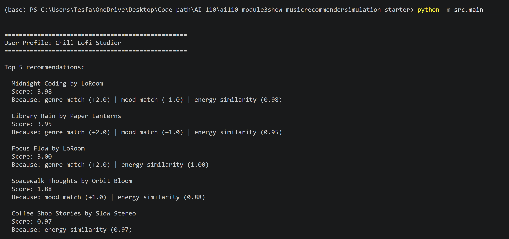
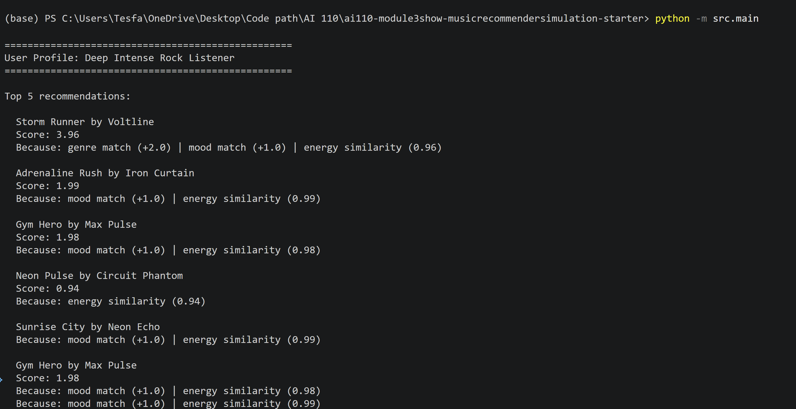

# Music Recommender Simulation

## Project Summary

This project simulates a content-based music recommender system. Given a user's taste profile — their preferred genre, mood, and energy level — the system scores every song in an 18-track catalog and returns the top 5 recommendations, each with a plain-language explanation of why it was chosen.

---

## How The System Works

### Real-World Context

Streaming platforms like Spotify and YouTube use two main recommendation strategies:

- **Collaborative filtering** looks at what *other users* with similar listening habits have enjoyed. If thousands of people who like the same songs as you also love a particular track, the system learns to suggest it to you.
- **Content-based filtering** looks at the *attributes of the songs themselves* — genre, tempo, mood, energy — and recommends songs that match your stated or inferred preferences.

VibeFinder 1.0 implements a simplified content-based filter. Instead of learning from other users, it compares each song's attributes directly to the user's declared preferences and computes a numeric match score.

### Features Each Song Uses

| Feature | Type | Role in scoring |
|---------|------|----------------|
| `genre` | string | Hard match — worth +2.0 points |
| `mood` | string | Hard match — worth +1.0 points |
| `energy` | float (0.0–1.0) | Continuous similarity — worth up to +1.0 points |
| `tempo_bpm` | int | Stored, reserved for future scoring |
| `valence` | float (0.0–1.0) | Stored, reserved for future scoring |
| `danceability` | float (0.0–1.0) | Stored, reserved for future scoring |
| `acousticness` | float (0.0–1.0) | Stored, reserved for future scoring |

### What UserProfile Stores

| Field | Type | Meaning |
|-------|------|---------|
| `favorite_genre` | string | The genre the user most prefers |
| `favorite_mood` | string | The mood they are looking for |
| `target_energy` | float | How high-energy they want the music (0.0–1.0) |
| `likes_acoustic` | bool | Acoustic preference flag (reserved for future use) |

### Scoring Formula

Each song receives a score out of a maximum of **4.0 points**:

```
score = 0.0

if song.genre == user.favorite_genre:   score += 2.0   # "genre match (+2.0)"
if song.mood  == user.favorite_mood:    score += 1.0   # "mood match (+1.0)"
energy_similarity = 1.0 - abs(song.energy - user.target_energy)
score += energy_similarity                             # "energy similarity (X.XX)"
```

The energy formula rewards closeness: a song with energy exactly matching the user's target earns a full +1.0, while a song 0.5 away earns +0.5.

### Data Flow Diagram



---

## Getting Started

### Setup

1. Create a virtual environment (optional but recommended):

   ```bash
   python -m venv .venv
   source .venv/bin/activate      # Mac or Linux
   .venv\Scripts\activate         # Windows
   ```

2. Install dependencies:

   ```bash
   pip install -r requirements.txt
   ```

3. Run the app:

   ```bash
   python -m src.main
   ```

### Running Tests

```bash
pytest
```

---

## Experiments You Tried



### Three User Profiles Tested

**High-Energy Pop Fan** (`genre: pop, mood: happy, energy: 0.9`)
- Top results: "Gym Hero" (pop/intense, energy 0.93) and "Sunrise City" (pop/happy, energy 0.82) dominated.
- "Sunrise City" ranked above "Gym Hero" because its mood ("happy") matched the user's preference, earning an extra +1.0 point despite slightly lower energy.

**Chill Lofi Studier** (`genre: lofi, mood: chill, energy: 0.4`)
- The three lofi/chill songs (Midnight Coding, Library Rain, Focus Flow) occupied top spots. Library Rain ranked slightly lower because its "focused" mood didn't match "chill."
- Songs outside lofi fell far behind, confirming the genre weight dominates.

**Deep Intense Rock Listener** (`genre: rock, mood: intense, energy: 0.95`)
- "Storm Runner" (rock/intense, energy 0.91) ranked first with a near-perfect score.
- "Adrenaline Rush" (metal/intense, energy 0.96) ranked second — it earned the mood match (+1.0) and near-perfect energy similarity even without a genre match, beating out weaker energy matches from other genres.

### Weight Experiment: Doubling Energy Importance

When the energy scoring was doubled (by multiplying the energy similarity by 2.0), the pop fan's results shifted: "Gym Hero" moved above "Sunrise City" because the energy advantage (0.03 closer) now outweighed the mood bonus. This illustrated how small weight changes cascade through rankings in ways that aren't always intuitive.

---

## Limitations and Risks

- The catalog has only 18 songs — too small for meaningful diversity.
- Genre matching is binary: "indie pop" and "pop" are treated as completely unrelated.
- The system requires users to explicitly state their preferences; it cannot infer them from listening behavior.
- Songs with rare genres (world, folk, metal) can never win genre match points against pop or lofi profiles, reducing their visibility.
- Tempo, valence, danceability, and acousticness are stored but not yet scored, leaving useful signal unused.

---

## Reflection

See [model_card.md](model_card.md) for the full Model Card.

Building this recommender revealed that the hardest part of recommendation is not the math — the scoring formula is just a few lines — but the *design choices* behind the weights. Deciding that genre is worth twice as much as mood is a value judgment that determines which songs get heard and which get buried. Real apps like Spotify face the same choices at massive scale, and the weight decisions they make invisibly shape what music gets discovered. Understanding this system made those invisible choices visible.
